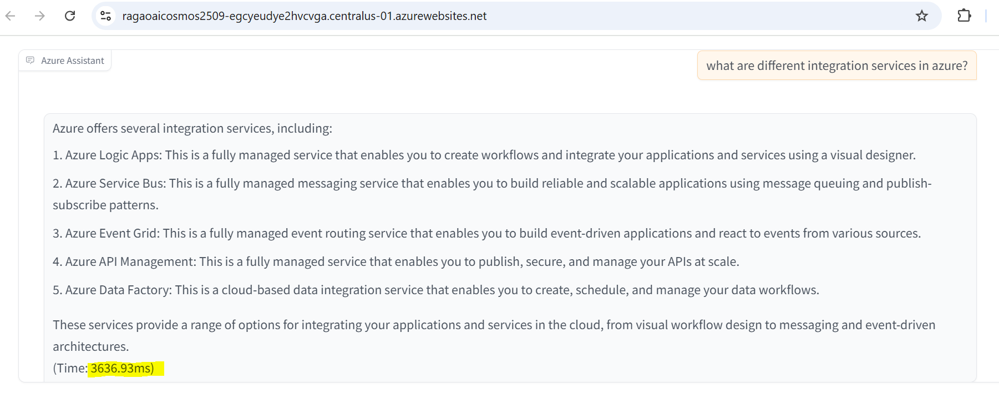
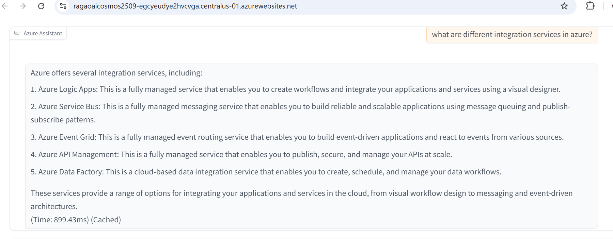

# Implement RAG with Azure Cosmos db as VectorStore
Repo that explains how to enable vector store features in Azure cosmos db and implement
a simple RAG app using Azure Open AI and Azure Cosmos Db as vector store.

# Enabling Vector Store capabilities in Azure Cosmos db
Let us see how to enable vector search in Azure cosmos db. For complete details on Azure cosmos db powerful vector store feature, please go through link 
https://learn.microsoft.com/en-us/azure/cosmos-db/nosql/vector-search
  * Enable feature Vector Search for NoSQL API under features
    

  * Container Vector Policies :
     Performing vector search with Azure Cosmos DB for NoSQL requires you to define a vector policy for the container. This 
     provides essential information for the database 
     engine to conduct efficient similarity search for vectors found in the container's documents. This also informs the 
     vector indexing policy of necessary information,  should you choose to specify one. The following information is 
     included in the contained vector policy:

      * “path”: the property containing the vector (required).
      * “datatype”: the data type of the vector property (default Float32). 
      * “dimensions”: The dimensionality or length of each vector in the path. All vectors in a path should have the same  
        number of dimensions. (default 1536).
      * “distanceFunction”: The metric used to compute distance/similarity. Supported metrics are:
          cosine, which has values from -1 (least similar) to +1 (most similar).
          dot product, which has values from -inf (least similar) to +inf (most similar).
          euclidean, which has values from 0 (most similar) to +inf) (least similar).
       
  * Policy with Single Vector Path

    

    

  * Vector Indexing Policies
    Vector indexes increase the efficiency when performing vector searches using the VectorDistance system function. Vectors searches have lower latency, higher throughput, 
    and less RU consumption when using a vector index. You can specify the following types of vector index policies:

    

    Example of valid vector indexing policy

   

   

# Implement RAG using Azure Cosmos db As vector store and Azure Open AI Service.

The code for the solution is in the python notebook "cosmosdb-nosql-vector-azureopenai-tutorial.ipynb" which is in the repo. Execute each cell one after the other to see it in action.

# Prerequisites
   * Azure Cosmos DB: Create a Cosmos Account and enable vector feature. Go to Cosmos account --> Settings --> Features -->Select the Vector Search in Azure Cosmos DB for NoSQL” feature --> Enable
   * Azure OpenAI Service : Azure Open AI Service with GPT-35-Turbo/GPT-4o and text-embedding-ada-002 models
     
   * Environment Setup: Ensure you have Python installed and can run Jupyter Notebooks.
     https://code.visualstudio.com/docs/datascience/jupyter-notebooks
     
# Walk through of the code in each cell of python notebook
   * Install the required Python packages listed in requirements.txt.
   * Imports all the necessary libraries required for the notebook:
   * Load the required environment variables from a .env file.
   * Initialize the Azure OpenAI and Cosmos DB clients using the loaded environment variables.
   * Create Containers with container vector policy and vector indexing policy. cache container is to implement semantic caching which saves user prompt along with response and if user enters same prompt the response will be returned from the cache container instead of doing vector search again.
   * Define functions for generating embeddings, inserting documents into Cosmos DB, retrieving chat history, performing vector searches, and inserting chat documents.
   * Note :we are using Gradio framework for spinnig up a simple chat like interface.
# Application Screenshots

  user prompt and response

  
  
  cached result

  
